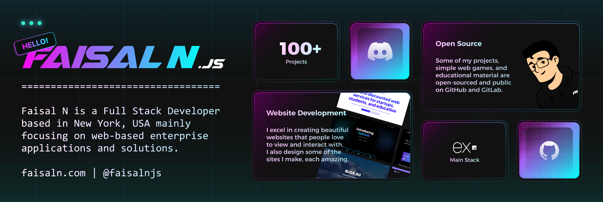

This README is no longer maintained; check out [my website](https://faisaln.com) for my updated profile.

Like my work? Consider [donating](https://www.buymeacoffee.com/faisaln)!

[](https://discord.gg/5djHSwTfSX)


[](https://github.com/faisalnjs/Math-Puzzle)
[](https://github.com/faisalnjs/Click-Quick)
[](https://github.com/faisalnjs/Synthwave-2077)
[](https://github.com/faisalnjs/java)
[](https://github.com/faisalnjs/SQL)
[](https://github.com/faisalnjs/Breast-Cancer-Research)


## My Statistics (GitHub Only)

I do most major closed-source programming for enterprise on Gitlab. Click [here](https://gitlab.com/faisalnjs) to my contributions there.


## Profile Views


## GPG Key

To verify if I authored a commit myself, you may compare the submitted private key to my public key to find authenticity. My latest GPG keys can be accessed via [GitHub](https://github.com/faisalnjs.gpg), [GitLab](https://gitlab.com/faisalnjs.gpg), or below:

```plaintext
-----BEGIN PGP PUBLIC KEY BLOCK-----

mQINBGT6JaQBEADZZJmcqGm3jedtT2vrXzmZP01HKrllVGa01scoJl2UtL5hfdzJ
BN9cjAcxJKURkxPbIBg+aExHuI7omf/blTCALW9DZY7Vypr3gS5Oo0nSf4sE+mlC
U2sbFbAowYYWQBth2HODvQLUPWPP+ldSS5LTI6TnAZaVHELPkPF0pNLmnL2osbPU
k5AMGAJ2vgFnwZ0CKrSPJxze4A5UlV5xX5c/kPSSsEnsEIpTOcgseFbnPe1AJb9Q
4b6SpQYI09JKu91kJSf4D7liThptlA2+r9zJyz8JfT8Kyn0P3SkyKxd6YFJRsFLZ
HNhknvPZa7j28IdzKMOP4+8fUnwc7go2h+AT/qXYmIMFixx9LIHJOsPLujhNgWni
sSbUkpviiiP1wzr4hGy5NcSnHBB0VcGwAqkdDpHFoM5x/D0EMfTejpD+StxE0oMv
hWyseWsdoj52CvtIbs2kuS/2ph0cu1964uE2STVutkxED0iPI2bzcyVXWBrWTBfw
m70mz8RfxNvRZt4DOT3jOhdJcxpHU5lh6r1sXF6xygQOLQ0ljiuI51bWSCL8sqXX
cVxkyrIXyhmllfayd8MGjPJrRAF6IHERqNc6C0O2D9F3hi4VYXXcoLVzBRcWoPVS
OCFqH0ueb3Mx43pliJ32f6KTRCSq47jcuwymET+/JZpKsRjEmORXD74qbwARAQAB
tB5GYWlzYWwgTiA8Y29udGFjdEBmYWlzYWxuLmNvbT6JAlEEEwEIADsWIQT0Z3D0
Np0AqGBjfU4/jJK3Uo3B1gUCZPolpAIbAwULCQgHAgIiAgYVCgkICwIEFgIDAQIe
BwIXgAAKCRA/jJK3Uo3B1ltbD/kB11j9GhmXBHvHXNKwMXP7nnmh7elSvZSXkR8J
8FvqQI8XsdXhuBN75Nj0lR7a2jOyJ15ncecq7gYPxMxKVQy+DuMcsWkU+ROpSREW
G9p2U2WirHMknlBmgDMr6cjSwIn0KM+UGcxUG3+4ObrpRCA1DsgsuRVFuXTW1TFA
UM1HTf4i1z9qqqUcNQBOm2CC9x27GNntbNSCLRemtE7U6FhMacM4vorromxzc1LG
NBaF6nN1waIqztWFbCm5xXqupfEjjT94+grrzHM/rB9yaJs36Tmqwp2uqbJd+mX9
jkKjwsEAx3BI+NMQUW6RwiLK2NHB+B/CEUAhWbourQZGnflBc8FAEYCBr+3mfs7W
laVetCvZJkGi+lomIuUPbVUqaRKINIY1EvwFCfDltmc3124Rg94d2+fYwM6h/1Hf
1i4WFR1uMiwyXVvnzU8cDhlQi1YSbvoTKFFrdnJ0brwMFEHMM41+q/Qxsm3rBbY3
qTNqp3IVOJKg7FpYPZxGu5nJqWNQLh1uaZ8prZ/RFEZMW8AQFxAzNZ92iU4f/VRl
Vcq46zAidJNXoeFEVGdVeF6Q+ZApoAjhLIZvDVFnvV2f9eEYnQFPmbfEFNUHkC5h
Zzx+/5FNs+uauTzjmmhvOq3XRy8X7hv/cmrKjLFEllpofHBFEFhrpxitAhq5Hpzs
Kj4OxbkBjQRk+iWkAQwAy4U0dY+C6FvSFuA6cJJJlYRIHcEQ+wDEwgs1Z77fcA1j
zrnth+9N+Z5ax6TiJmaf+mvbfPHlcOR8vm6j9+r4CM3EHQwP5YHq0eYg4PUFDc+4
rhxvcF4N9XUafv435k/gFpYEMkB8v72filOjSkGu1Do/k0osG4leOYdD27KgJ12c
/hghhG8vXRdilGKdF42z+fZEI029JVV27qyIHZZCJa0PI9Xmk4EWftd8+wWSZ4+p
IeSOQ9czjW7Yfh37uc0luU6HoLR19hyYqahHAGOL620pE+uQbb/7arTcIuFLo3er
dGDiUi6uPeoefWFzzNwXIz32UbREOhLIIE2s2yyQJdASTSYB7xghybOPlbklZsAv
yPP1uWRPD41mwwSYOJHejaUW+3ofFlmzluJIl4+SDYmQ4O6WRAs7VuxKyNkecpot
NscJHl4MpK1I3I4qwSmU3XzwphFjqzmbi5dvulynaH0GJtCzdriBiEwI8ASkkHlf
tbeIxClXC7s56HoJabsnABEBAAGJAjYEGAEIACAWIQT0Z3D0Np0AqGBjfU4/jJK3
Uo3B1gUCZPolpAIbDAAKCRA/jJK3Uo3B1mhcD/4sT6FBmyO292i2l4yXEWNHFcyd
/bB9TD7UXLfb5jayw9OYwDlXK9dY4I9fZTHZ6+nyKkHQ0W3enYiRbnpy2rDxZVwT
l71V1ofMbnfPpZxDJBrfXo4mDbA8/MFuN05iSLfaaW0peg6A6hHuRdDh20DuXpZq
nM/CqIZfNLIQ7gg43kwg3ROJ9dDXivb2mIac1ybGh9DoxFUNTq+jhDEOKIGf4xSm
vnHaq6vjEwp361IXaqbvexVhvo5JbkHMQPune0SyrvKg/EB5mmHiVZhV9J/MbHIs
R/iA1etVq5j1ZLOF/tLHmcPYkmXpnTu+AWR8BRdTR8QYrrIYCOfG9QzAMsXWZLN/
4O7qXCdc5PnOlhHOK02DLEZfpzklnlWT+ObZb/7Y7PYhLx/x3B0Liej5mjfh52Q8
gd60DAP9ONhusK6a+uULXw+uYggsX63Pu1Vkko4PM5GRZKujIyUhwpZHEYGqcnEi
QoqSmvuFePe9buyM6TPPW2LejqT3M010f1tdKKci/X0jJAD1AFfTAk4y4EBXrRJ/
o9yGbypKe2carfo1VyDJdRCEhZBdwdBmSZfOHccRckMFURlUdNyBD6VsWxwE/oOE
ArO5bZX2qpp6XxfLD9jXRtnJKIXruTjc457iiuPtlJi42bTfexfy0zdFm0s0EaSX
f30lXsNmo1s5J5oMeg==
=0WF0
-----END PGP PUBLIC KEY BLOCK-----
```

## Extras


